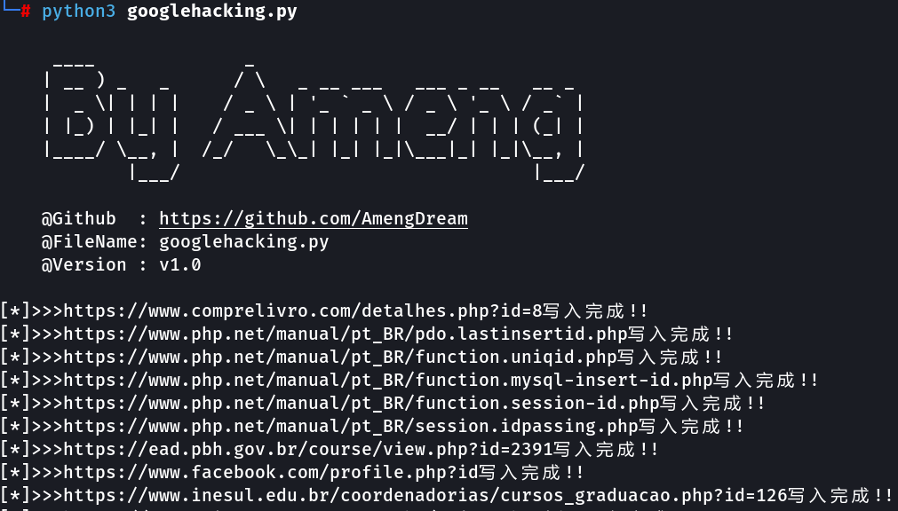

# GoogleHacking
爬取googlehacking结果的python脚本

### 使用方法

运行如下命令

```
python3 googlehacking.py 
```



结果保存在当前目录下的`Google.txt`文件中


## Tips

1.默认使用了谷歌镜像站，如果需要修改爬取站点自己改，代码里有备注

2.默认爬取10页，每爬取1页结果间隔3秒，需要自己改，间隔别太快，会被ban

3.当前v1.0版本限制了单线程，不需要挂代理，后续会更新一个添加多线程使用代理池的版本，速度会快很多。
